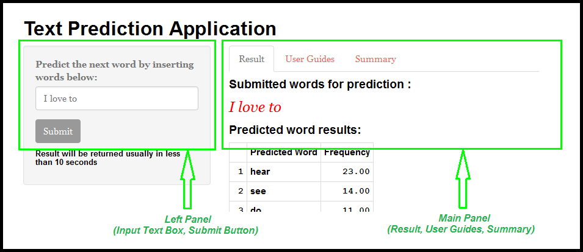

Text Prediction App
========================================================

Author : Rayner NYC  
Date      : 18 April 2016

<U>Introduction:</U>
<small> The objective of the Coursera Captone project is to create a text prediction application where user is able to insert/submit a few English words to the application and the application will predict what is the next word should be. 
 The Shiny app can be accessed at : 
 https://raynernyc.shinyapps.io/TextPredictionApp/
 The slide deck can be viewed at :
 https://raynernyc.shinyapps.io/TextPredictionApp/</small>

Text Prediction App - Description
========================================================
<small>The application is divided into 2 panels.</small>

<small>Left panel contains user text box input and submit button. 
 Main panel contains Result (prediction outcome), User Guides and Summary section.</small>

Instructions (User Guides)
========================================================
<small>
1. This application is limited to predicting English language word. 

2. The default words are: "I love to". Insert at least one or more English words into the text box at the left panel.

3. Click "Submit" button.

4. Allow some time for the application to process and predict the next word. The time taken is also depended on how fast your Internet connection is able to transfer the results back.

5. Your submitted word and the predicted word will be displayed on the right main panel (Result tab). The top maximum of 15 words sorted from highest frequency will be shown in table form.
</small>

Text Prediction App - Algorithm
========================================================
#### <U>Description :</U>
<small>The prediction algorithm is based on text mining and National Language Processing (NLP) methodology.</small>

#### <U>How it works :</U>
<small>A language model needs to be created based on the text (corpus), obtained from blog, news and twitter. The datasets needs to be cleaned/extracted before they can be used in modeling. More detailed in the following report:
http://rpubs.com/RaynerNYC/MilestoneReport

The language model created is based on N-grams, which is a group of N words formed from a given sequence of text and can be used to predict the next word. 
This application uses backoff algorithm to predict by starting to find the matching word with TriGrams. If there is no match, it will recursively try the second higher order n-grams to lower order n-grams. This application will return a maximum of top 15 predicted words.</small>

Text Prediction App - Performance
========================================================
<small>The source data has a combination of about 100 millions words and 550MB in size. Large datasets have a better prediction but will it will be slow for the application to process and return the result.

A reduced dataset is used so that Shiny App performs faster. 5% is sampled from the source data and still retaining about 90% of the more frequently used words. It will have better performance especially for mobile devices with smaller memory.

Therefore, the result of the predicted words might be different from what user is expecting as it is very much depended on the words contained in the reduced datasets. The frequency shows how often the predicted word appeared in the datasets, indirectly the highest frequency represents that the predicted word is the most likely/relevant word generally to anyone.</small>

Summary
========================================================
<small>A Shiny application has been successfully created to demonstrate the capability of text prediction based on the understanding of NLP. 

This application could be further enhanced by including a larger set of source data in the language model creation. In order to that, a better Web server with bigger/faster processing power could be used to host the application. 

Although this is a simple prototype, there are more to learn in NLP and text prediction such as predicting the next word which includes not only based on how frequent the word existed but also based on the understanding the language context, and etc. 

Nevertheless, it has been an interesting journey to learn and practice data science.</small>
